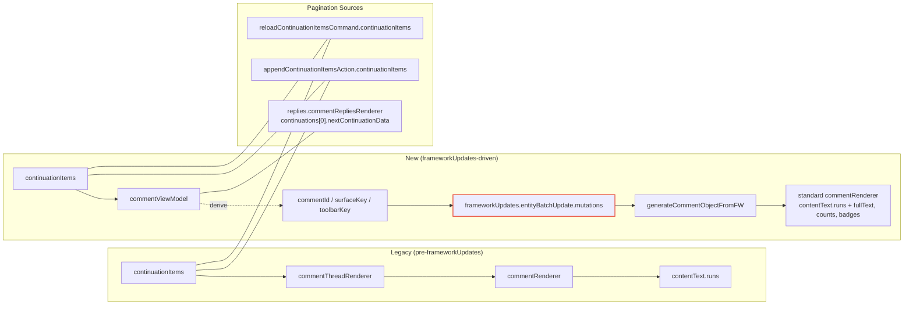

# Innertube (YouTube) New Response Integration Guide

This document explains how this repository migrated from the legacy Innertube response shape to the new frameworkUpdates‑driven model, what changed, and how to consume the new API reliably when loading comments.

---

## Why migrate
- In the legacy model, comment text was usually available directly in `commentRenderer.contentText.runs`.
- In the new model, YouTube provides comment data via `frameworkUpdates.entityBatchUpdate.mutations`. The `continuationItems` rendered in the page usually contain only `commentViewModel` containers. Real content must be joined from `frameworkUpdates`.
- If you continue to read `runs` only, you will often see “correct count but empty content”.

---

## Legacy vs New: structure overview

- Continuation containers (both required)
  - Top-level:
    - First page: `onResponseReceivedEndpoints[1].reloadContinuationItemsCommand.continuationItems`
    - Next pages: `onResponseReceivedEndpoints[0].appendContinuationItemsAction.continuationItems`
  - Replies:
    - Derive the next token from the parent thread (`replies.commentRepliesRenderer...`) or from keys embedded in `commentViewModel`

- Key difference
  - Legacy: `continuationItems[*].commentThreadRenderer.comment.commentRenderer.contentText.runs`
  - New: `continuationItems[*].commentThreadRenderer.commentViewModel.commentViewModel` (or `commentViewModel`)
    - Real content is reconstructed using `frameworkUpdates.entityBatchUpdate.mutations`

### Visual comparison (Mermaid)

---

## Core concepts for the new model

- Build `frameworkUpdatesById`
  - Source: `response.frameworkUpdates.entityBatchUpdate.mutations`
  - Useful keys:
    - `commentEntityPayload.properties.commentId` (content/author/toolbar)
    - `commentSurfaceEntityPayload.key` (published time, chips)
    - `engagementToolbarStateEntityPayload.key` (heart state)

- “Index → Generate” pipeline
  - Find `commentViewModel` in `continuationItems`
  - Resolve its `commentId/commentSurfaceKey/toolbarStateKey` using the index above
  - Convert `commandRuns/attachmentRuns` into legacy-like `runs` and assemble a standard `commentRenderer`

---

## Implemented helpers in this project (TS)

All located in `src/source/utils/assist.ts`:

- `getFrameworkUpdatesById(response)`
  - Builds `Record<string, any>` from mutations. Supports indexing by both `commentId` and entity `key`.

- `migrateRuns(baseText, rawRuns)`
  - Converts new `commandRuns/attachmentRuns` into legacy `runs`, preserving links, timestamps, and image attachments.

- `generateCommentObjectFromFW({ commentId, update, surfaceUpdate, toolbarStateUpdate })`
  - Produces standard `commentRenderer` (with `contentText.runs/fullText`, `likeCount/replyCount`, heart, verified/owner/sponsor, published time).

- `migrateContinuationItemsWithFW(continuationItems, frameworkUpdatesById)`
  - Normalizes `commentViewModel` / `commentThreadRenderer.commentViewModel` into items that contain `commentRenderer`. Also reconstructs replies `continuations` structure.

- `extractNextContinuation(response)` / `extractReplyContinuationFromItem(item)`
  - Parse the next-page / replies continuation token and click tracking params.

- `applyFrameworkUpdatesToComment(commentObj, vmSource, fwById)`
  - Safety pass to enrich heart/verified/owner/sponsor when needed.

---

## Recommended flow (Top-level)

1) Read `continuationItems` (prefer `reload`, then `append`).
2) Build `byId` via `getFrameworkUpdatesById(response)`.
3) Normalize with `migrateContinuationItemsWithFW(items, byId)` to obtain items that contain `commentRenderer`.
4) Push into the local list; optionally call `applyFrameworkUpdatesToComment(...)` for extra safety.
5) Use `extractNextContinuation(response)` for pagination until no more pages.

## Recommended flow (Replies)

1) Use `extractReplyContinuationFromItem(item)` to get the replies token.
2) Request and normalize with `getFrameworkUpdatesById` + `migrateContinuationItemsWithFW`.
3) Loop using `extractNextContinuation(response)` until all replies are loaded.

---

## Common pitfalls

- `commentViewModel` only, no content
  - Always join via `frameworkUpdates`; reading `runs` alone returns empty strings.

- Index by entity `key` only
  - The new response often uses `properties.commentId` as the stable key. Support both `commentId` and `key`.

- Links/attachments missing
  - Clickable segments and attachments are in `commandRuns/attachmentRuns`. Convert them via `migrateRuns`.

---

## Verification checklist

- Normal videos / Shorts / Live replays
- Both sort orders: Top comments / Newest first
- Large comment sets (> 5k) and deep pagination
- Threads with replies (load all replies)
- heart / verified / owner / sponsor properties visible

---

## Notes

- Keep verbose logs behind `?ycs_debug` when debugging; reduce logs by default for production builds.

---

## References
- Reference implementation (JS): `web-resources/wresources.js` (`getFrameworkUpdatesById`, `migrateContinuationItems`, `migrateContinuationSubItems`, `generateCommentObject`)
- TypeScript implementation (this repo): `src/source/utils/assist.ts` (equivalent helpers)
