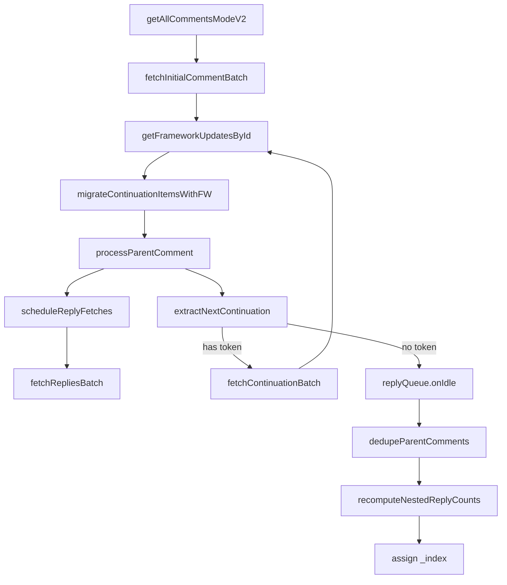

# Continuation Processing (Current Architecture)

## Goals

- Describe the current continuation processing flow used by YCS comment loading.
- Clarify responsibilities between orchestration and normalization layers.
- Document the modern frameworkUpdates-based pipeline and reply pagination behavior.

---

## Current Ownership

- Orchestration: `app/src/source/utils/innertube/comments.ts`
  - `getAllCommentsModeV2(...)`
  - Controls batch loop, reply queue scheduling, dedupe, and post-processing.

- Normalization and extraction: `app/src/source/utils/innertube/comments/pipeline.ts`
  - `getFrameworkUpdatesById(...)`
  - `migrateContinuationItemsWithFW(...)`
  - `processParentComment(...)`
  - `extractReplyContinuationFromItem(...)`
  - `extractSubThreads(...)`
  - `extractNextContinuation(...)`
  - `fetchInitialCommentBatch(...)`, `fetchContinuationBatch(...)`, `fetchRepliesBatch(...)`

- Web entry script: `app/src/source/web-resources/wresources.ts`
  - Bootstrap only. It is not a comment-processing implementation reference.

---

## End-to-End Flow

1. `getAllCommentsModeV2(...)` fetches first page via `fetchInitialCommentBatch(...)`.
2. `migrateContinuationItemsWithFW(...)` converts continuation items to normalized comment objects.
3. `processParentComment(...)` builds parent/reply candidates and continuation tokens.
4. `scheduleReplyFetches(...)` processes reply continuations with queue control.
5. Main loop fetches next page through `fetchContinuationBatch(...)` + `extractNextContinuation(...)`.
6. Finalization runs:
   - `dedupeParentComments(...)`
   - `recomputeNestedReplyCounts(...)` (in `comments.ts`)
   - `_index` re-assignment for stable ordering.

---

## Flow Diagram



---

## Continuation Sources

Top-level pages:
- Prefer `reloadContinuationItemsCommand.continuationItems`
- Fallback to `appendContinuationItemsAction.continuationItems`

Replies:
- `replies.commentRepliesRenderer.continuations[0].nextContinuationData`
- Fallback deep scan via `extractReplyContinuationFromItem(...)`

Nested replies:
- Recursive `subThreads` extraction through `extractSubThreads(...)`
- Supports continuation tokens at nested levels.

---

## Minimal Response Examples

Top-level continuation containers:

```json
{
  "onResponseReceivedEndpoints": [
    {
      "appendContinuationItemsAction": {
        "continuationItems": [{ "commentThreadRenderer": {} }]
      }
    },
    {
      "reloadContinuationItemsCommand": {
        "continuationItems": [{ "commentThreadRenderer": {} }]
      }
    }
  ]
}
```

Reply token shape:

```json
{
  "commentThreadRenderer": {
    "replies": {
      "commentRepliesRenderer": {
        "continuations": [
          {
            "nextContinuationData": {
              "continuation": "Egh4eHl6",
              "clickTrackingParams": "CBkQ8JMBGAEiE..."
            }
          }
        ]
      }
    }
  }
}
```

Nested `subThreads` continuation shape:

```json
{
  "commentRepliesRenderer": {
    "subThreads": [
      {
        "continuationItemRenderer": {
          "continuationEndpoint": {
            "continuationCommand": { "token": "EgpzdWJ0aHJlYWQ=" },
            "clickTrackingParams": "CB4Q8JMBGAEiE..."
          }
        }
      }
    ]
  }
}
```

---

## FrameworkUpdates Strategy

- Build lookup map with `getFrameworkUpdatesById(response)`.
- Index by both `commentId` and entity `key`.
- Reconstruct comment renderer via `generateCommentObjectFromFW(...)`.
- Apply attribute enrichment (heart/verified/owner/sponsor) through FW data first.

---

## Legacy Name Mapping

The following names are historical and are no longer active entry points in the TypeScript source:

- `processComments(...)`
- `migrateContinuationItems(...)` / `migrateContinuationSubItems(...)`
- `_getAllRepliesComment(...)`
- `_prepareFieldsComment(...)`

Use current equivalents documented in this file instead.

---

## Quick Reference

- `app/src/source/utils/innertube/comments.ts`
  - `getAllCommentsModeV2(...)`

- `app/src/source/utils/innertube/comments/pipeline.ts`
  - `getFrameworkUpdatesById(...)`
  - `migrateContinuationItemsWithFW(...)`
  - `processParentComment(...)`
  - `extractReplyContinuationFromItem(...)`
  - `extractSubThreads(...)`
  - `extractNextContinuation(...)`
  - `fetchInitialCommentBatch(...)`
  - `fetchContinuationBatch(...)`
  - `fetchRepliesBatch(...)`
