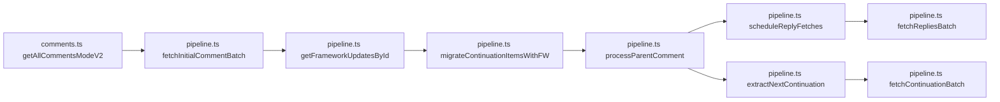

# Innertube Comments Integration Guide (Current)

This document describes the active Innertube comment integration in YCS.

---

## TL;DR Checklist

- Build `frameworkUpdatesById` from `response.frameworkUpdates.entityBatchUpdate.mutations`.
- Normalize continuation items with `migrateContinuationItemsWithFW(...)`.
- Use `processParentComment(...)` to collect parent/reply items and reply continuations.
- Use batch helpers for paging:
  - `fetchInitialCommentBatch(...)`
  - `fetchContinuationBatch(...)`
  - `fetchRepliesBatch(...)`
- Run reply queue scheduling through `scheduleReplyFetches(...)`.
- Finalize with `dedupeParentComments(...)` and nested reply count recompute.

---

## Module Split

### Orchestration

`app/src/source/utils/innertube/comments.ts`

- `getAllCommentsModeV2(...)` is the main entry.
- Handles loading loop, queue lifecycle, limit checks, dedupe, and index assignment.

### Processing Pipeline

`app/src/source/utils/innertube/comments/pipeline.ts`

- FW indexing: `getFrameworkUpdatesById(...)`
- Comment construction: `generateCommentObjectFromFW(...)`
- Continuation normalization: `migrateContinuationItemsWithFW(...)`
- Parent/reply extraction: `processParentComment(...)`
- Token extraction:
  - `extractNextContinuation(...)`
  - `extractReplyContinuationFromItem(...)`
- Nested replies:
  - `extractSubThreads(...)`
- Batched fetch helpers:
  - `fetchInitialCommentBatch(...)`
  - `fetchContinuationBatch(...)`
  - `fetchRepliesBatch(...)`

---

## Architecture Diagram



---

## Data Flow

1. Fetch first comment response.
2. Build FW lookup map.
3. Normalize continuation items to comment candidates.
4. Process candidates into:
   - Parent comments
   - Direct replies
   - Nested replies (subThreads)
   - Reply continuation queue entries
5. Fetch next page continuation and repeat.
6. Drain reply queue and merge results.
7. Recompute nested reply count and assign stable `_index`.

---

## Data Examples

Framework updates map input (simplified):

```json
{
  "frameworkUpdates": {
    "entityBatchUpdate": {
      "mutations": [
        {
          "payload": {
            "commentEntityPayload": {
              "properties": {
                "commentId": "Ugz123",
                "content": { "content": "hello world" },
                "replyLevel": 0
              }
            }
          }
        }
      ]
    }
  }
}
```

Normalized continuation item output (target shape):

```json
{
  "commentThreadRenderer": {
    "comment": {
      "commentRenderer": {
        "commentId": "Ugz123",
        "contentText": {
          "runs": [{ "text": "hello world" }]
        },
        "replyCount": 2
      }
    }
  },
  "replyLevel": 0
}
```

---

## Continuation Rules

Top-level:
- Prefer `reloadContinuationItemsCommand.continuationItems`.
- Then fallback to `appendContinuationItemsAction.continuationItems`.

Replies:
- Prefer `replies.commentRepliesRenderer.continuations[0].nextContinuationData`.
- Fallback to deep scan in `extractReplyContinuationFromItem(...)`.

Nested:
- `extractSubThreads(...)` recursively scans `subThreads` and nested continuation tokens.

---

## Notes on Historical References

Older docs and discussions may mention:

- `processComments(...)`
- `_getAllRepliesComment(...)`
- `src/source/utils/assist.ts` as the main comment pipeline

These are legacy references. The active implementation is under `comments.ts` + `comments/pipeline.ts`.
