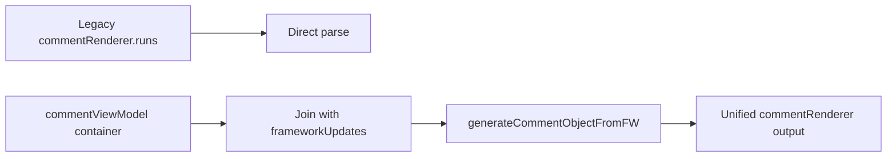

# Innertube Comments Migration Guide (Legacy -> Current)

This guide explains how YCS migrated from legacy renderer-centric parsing to the current frameworkUpdates-driven pipeline.

---

## Why Migration Was Needed

Legacy model:
- Comment text commonly available in `commentRenderer.contentText.runs`.

Current model:
- `continuationItems` often carry `commentViewModel` containers.
- Actual comment data is stored in `frameworkUpdates.entityBatchUpdate.mutations`.
- Robust parsing requires joining continuation items with framework updates.

---

## Legacy vs Current Example

Legacy-style comment payload:

```json
{
  "commentThreadRenderer": {
    "comment": {
      "commentRenderer": {
        "commentId": "UgzLegacy",
        "contentText": { "runs": [{ "text": "legacy text" }] }
      }
    }
  }
}
```

Current-style split payload:

```json
{
  "continuationItems": [
    {
      "commentThreadRenderer": {
        "comment": {
          "commentViewModel": {
            "commentViewModel": {
              "commentId": "UgzNew",
              "commentSurfaceKey": "comment-surface-1"
            }
          }
        }
      }
    }
  ],
  "frameworkUpdates": {
    "entityBatchUpdate": {
      "mutations": [
        {
          "payload": {
            "commentEntityPayload": {
              "properties": {
                "commentId": "UgzNew",
                "content": { "content": "new text from FW" }
              }
            }
          }
        }
      ]
    }
  }
}
```

---

## Current Implementation Map

Primary files:

- `app/src/source/utils/innertube/comments.ts`
  - Main orchestration: `getAllCommentsModeV2(...)`

- `app/src/source/utils/innertube/comments/pipeline.ts`
  - FW indexing: `getFrameworkUpdatesById(...)`
  - Item normalization: `migrateContinuationItemsWithFW(...)`
  - Comment generation: `generateCommentObjectFromFW(...)`
  - Parent/reply extraction: `processParentComment(...)`
  - Nested replies: `extractSubThreads(...)`
  - Continuations: `extractNextContinuation(...)`, `extractReplyContinuationFromItem(...)`
  - Batch fetch: `fetchInitialCommentBatch(...)`, `fetchContinuationBatch(...)`, `fetchRepliesBatch(...)`

---

## Migration Diagram



---

## Recommended Processing Order

1. Read continuation items (reload first, append fallback).
2. Build FW map with `getFrameworkUpdatesById(...)`.
3. Normalize with `migrateContinuationItemsWithFW(...)`.
4. Process parent/reply/nested entries with `processParentComment(...)`.
5. Schedule and fetch reply continuations.
6. Iterate until `extractNextContinuation(...)` returns no token.
7. Finalize list with dedupe + nested reply count correction.

---

## Legacy Terms (For Context)

These names are historical and should not be treated as active entry points:

- `processComments(...)`
- `migrateContinuationItems(...)`
- `migrateContinuationSubItems(...)`
- `_getAllRepliesComment(...)`
- `assist.ts`-centric pipeline

---

## Verification Checklist

- Supports modern `commentViewModel` responses.
- Uses FW data for content and badges.
- Handles top-level + reply + nested continuation tokens.
- Preserves stable ordering via `_index`.
- Works for large pages with reply queue scheduling.
