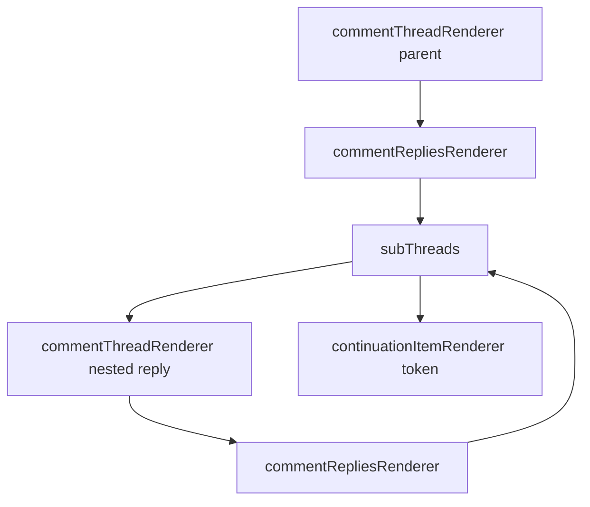

# Innertube Nested Comments: Current Implementation Status

**Document Version:** 2.0
**Date:** 2026-02-14
**Document Type:** Implementation Status and Technical Notes

---

## Summary

Nested comment support is implemented in the current pipeline.

Implemented capabilities include:

- Recursive `subThreads` traversal
- Nested continuation token extraction
- `replyLevel` propagation into `CommentItem`
- Parent/reply relationship preservation
- Reply count correction for nested structures

---

## Structure Diagram



---

## Implemented Components

### 1) FrameworkUpdates indexing

`app/src/source/utils/innertube/comments/pipeline.ts`

- `getFrameworkUpdatesById(...)`
- Indexes by both `commentId` and entity `key`.

### 2) Nested extraction

`app/src/source/utils/innertube/comments/pipeline.ts`

- `extractSubThreads(...)`
- Recursively scans `commentRepliesRenderer.subThreads`
- Supports nested continuation tokens
- Applies depth guard with `MAX_SUBTHREAD_DEPTH`

### 3) Continuation handling

`app/src/source/utils/innertube/comments/pipeline.ts`

- `extractReplyContinuationFromItem(...)`
- Supports common renderer paths and deep fallback scanning

### 4) Reply level field

`app/src/source/utils/interfaces/i_types.ts`

- `CommentItem.replyLevel?: number`
- Used for nesting semantics and rendering logic.

### 5) Post-processing corrections

`app/src/source/utils/innertube/comments.ts`

- `recomputeNestedReplyCounts(...)`
- Corrects reply counts for nested levels based on collected children.

---

## Data Examples

Nested input shape (simplified):

```json
{
  "commentThreadRenderer": {
    "comment": { "commentViewModel": { "commentViewModel": { "commentId": "PARENT" } } },
    "replies": {
      "commentRepliesRenderer": {
        "subThreads": [
          {
            "commentThreadRenderer": {
              "comment": { "commentViewModel": { "commentViewModel": { "commentId": "CHILD_1" } } },
              "replies": {
                "commentRepliesRenderer": {
                  "subThreads": [
                    {
                      "continuationItemRenderer": {
                        "continuationEndpoint": {
                          "continuationCommand": { "token": "SUBTOKEN_L2" }
                        }
                      }
                    }
                  ]
                }
              }
            }
          }
        ]
      }
    }
  }
}
```

Normalized result shape (simplified):

```json
[
  { "commentRenderer": { "commentId": "PARENT" }, "typeComment": "C", "replyLevel": 0 },
  {
    "commentRenderer": { "commentId": "CHILD_1" },
    "typeComment": "R",
    "replyLevel": 1,
    "originComment": { "commentRenderer": { "commentId": "PARENT" } }
  }
]
```

Nested continuation entry carried to queue:

```json
{
  "token": "SUBTOKEN_L2",
  "originComment": { "commentRenderer": { "commentId": "CHILD_1" } },
  "replyLevel": 2
}
```

---

## Current Processing Flow

1. Normalize continuation items with `migrateContinuationItemsWithFW(...)`.
2. Process each parent via `processParentComment(...)`.
3. For replies renderer with subThreads:
   - call `extractSubThreads(...)`
   - collect nested comments + continuations
4. Schedule continuation fetch with `scheduleReplyFetches(...)`.
5. After all loads complete:
   - run parent dedupe
   - recompute nested reply counts
   - assign stable indices

---

## Edge Cases Handled

- Empty `subThreads` containers
- Nested comments with missing immediate payload content
- Continuation entries appearing at nested depths
- Duplicate continuation tokens are deduped; tokenless continuations are tracked but not deduped
- Cases where renderer `replyCount` creates ghost-expand behavior

---

## Known Constraints

- Recursion depth is intentionally capped (`MAX_SUBTHREAD_DEPTH = 5`) to avoid runaway traversal.
- API response shapes continue evolving; deep fallback extraction remains necessary.
- Reply count still depends on retrieved data scope (e.g., aborted/limited loads can undercount).

---

## Verification Checklist

- Nested replies (reply-to-reply) are present in exported and searchable data.
- `replyLevel` is populated for parent, direct reply, and deeper replies.
- Nested continuation tokens are discovered and fetched.
- Parent/reply linkage (`originComment`) remains stable after normalization.
- No duplicate continuation storms in deep threads.
