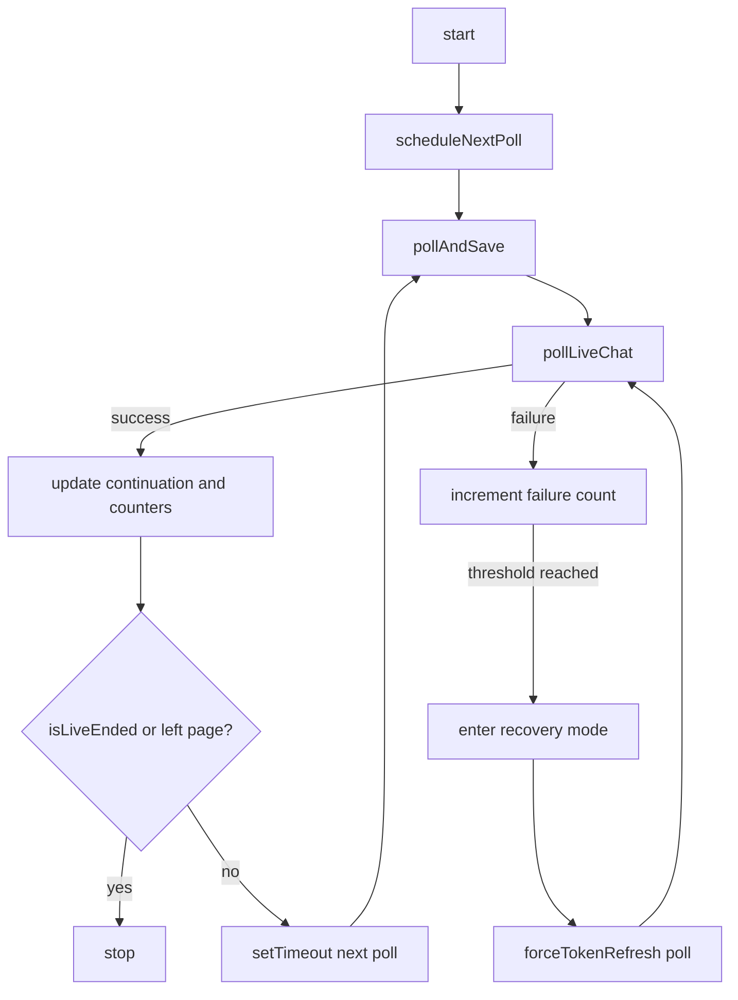

# Live Chat Recording (Current Architecture)

This document describes the current live chat recording implementation, including polling, recovery, and persistence behavior.

---

## Key Components

| File | Purpose |
|------|---------|
| `app/src/source/web-resources/features/liveChatRecorder.ts` | Main recording implementation (`LiveChatRecorder`) |
| `app/src/source/web-resources/appController.ts` | DI wiring and recorder initialization |
| `app/src/source/web-resources/state.ts` | `LiveRecordingState` and state helpers |
| `app/src/source/utils/innertube/chat.ts` | `pollLiveChat()`, `checkIsLiveStream()`, `getLiveBroadcastStartTime()` |
| `app/src/source/utils/libs.ts` | HTTP retry policy via fetch-retry |
| `app/src/source/content-scripts/style.css` | Recording UI styles |

---

## Ownership Split

- `appController.ts` initializes recorder dependencies via `createLiveChatRecorder(...)`.
- `LiveChatRecorder` owns start/stop/schedule/poll logic.
- Innertube module owns continuation token fetching and live-end detection.

---

## Recorder Lifecycle

`LiveChatRecorder` (in `liveChatRecorder.ts`) exposes:

- `start()`
- `stop()`
- `pollAndSave(startVideoId)`
- `scheduleNextPoll(startVideoId)`

Flow summary:

1. `start()` validates context and initializes recording state.
2. `scheduleNextPoll(...)` runs serial polling with `setTimeout` recursion.
3. `pollAndSave(...)` calls `pollLiveChat(...)` and updates state/UI.
4. On stop conditions, `stop()` clears timers, aborts requests, saves cache, and resets state.

---

## Recorder Flow Diagram



---

## Configuration Constants

Defined in `liveChatRecorder.ts`:

- `RECORDING_POLL_INTERVAL = 5000`
- `MAX_CONSECUTIVE_FAILURES = 3`
- `MAX_RECOVERY_ATTEMPTS = 2`
- `RECOVERY_BACKOFF_MS = 5000`
- `CACHE_SAVE_INTERVAL_MS = 60000`

---

## Poll Result Example

`pollLiveChat(...)` returns:

```typescript
{
  continuation: { timedContinuationData: { continuation: "Cj0..." } },
  isLiveEnded: false,
  success: true
}
```

Token stale case:

```typescript
{
  continuation: { timedContinuationData: { continuation: "old-token" } },
  isLiveEnded: false,
  success: false,
  errorType: 'token_stale',
  httpStatus: 403
}
```

---

## Retry and Recovery Strategy

### Tier 1: HTTP-level retries

- Provided by fetch-retry setup in `libs.ts`.
- Handles transient network/server failures.

### Tier 2: Application-level recovery

- In `pollAndSave(...)` when repeated failures occur.
- Uses `pollLiveChat(..., forceTokenRefresh=true)` to refresh continuation token.
- Enters recovery mode after 3 consecutive failures.
- Stops recording after recovery attempts exceed configured threshold.

---

## Live-End and Auto-Stop Conditions

Recording auto-stops when any of the following happens:

1. Live stream ended (`isLiveEnded` from `pollLiveChat(...)`).
2. User navigated to a different video while recording.
3. Recovery attempts exceeded limit.
4. User manually clicks stop.

`pollLiveChat(...)` determines live-end using continuation type checks (`invalidationContinuationData` presence).

---

## Persistence Behavior

- Periodic save: every 60 seconds during recording.
- Final save: on stop and before forced auto-stop paths.
- Cache payload uses `chatSource: 'live-recording'` for source tracking.

---

## UI Behavior

- Button states:
  - normal
  - recording
  - warning (reconnecting)
- Timer:
  - elapsed duration in normal mode
  - reconnecting message during recovery
- Toast:
  - shown when recorder gives up after max recovery attempts.

UI utilities are in `liveChatRecorder.ts`:
- `updateRecordingWarningUI(...)`
- `showToast(...)`

---

## Resume Behavior

On start, recorder checks existing chat map in state:

- if data exists, continue from cached session context
- otherwise start fresh chat collection
