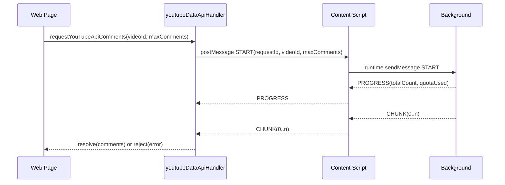

# YouTube Data API Messaging Architecture (Current)

This document describes the current messaging architecture for YouTube Data API v3 integration.

---

## Overview

YCS routes YouTube Data API requests through background service worker to keep API keys out of web page context.

Core reasons:

1. API key must stay in background storage.
2. Web page cannot directly use extension storage APIs.
3. Large comment sets require chunked transfer for message-size safety.

---

## Three-Layer Communication Model

```
YouTube.com Page (Web Resources)
|- appController.ts
|  |- invokes requestYouTubeApiComments(...) via handler
|
|- Handler: web-resources/handlers/youtubeDataApiHandler.ts
|  |- requestYouTubeApiComments()
|  |- window.postMessage() <-> Content Script
|
|- Content Script: content-scripts/cscripts.ts
|  |- relay window messages <-> chrome.runtime.sendMessage
|
`- Background: background.ts
   |- fetchAllCommentsBackground()
   |- API key in chrome.storage.local
   |- chunk/progress/error responses
```

---

## Sequence Diagram



---

## Message Types

### Requests (Web -> Background)

- `YCS_YT_API_COMMENTS_START`
- `YCS_YT_API_COMMENTS_ABORT`

### Responses (Background -> Web)

Primary active responses:
- `YCS_YT_API_COMMENTS_PROGRESS`
- `YCS_YT_API_COMMENTS_CHUNK`
- `YCS_YT_API_COMMENTS_ERROR`

Compatibility path retained in handler/content script:
- `YCS_YT_API_COMMENTS_COMPLETE` (legacy small-payload handling)

---

## Payloads

### START

```typescript
{
  type: 'YCS_YT_API_COMMENTS_START',
  body: {
    videoId: string,
    requestId: string,
    maxComments?: number
  }
}
```

Example:

```json
{
  "type": "YCS_YT_API_COMMENTS_START",
  "body": {
    "videoId": "dQw4w9WgXcQ",
    "requestId": "d4821f60-6b1a-4d42-9a3f-2f2f9c4e9c3e",
    "maxComments": 5000
  }
}
```

### ABORT

```typescript
{
  type: 'YCS_YT_API_COMMENTS_ABORT',
  body: {
    requestId: string
  }
}
```

### PROGRESS

```typescript
{
  type: 'YCS_YT_API_COMMENTS_PROGRESS',
  body: {
    requestId: string,
    totalCount: number,
    quotaUsed: number
  }
}
```

### CHUNK

```typescript
{
  type: 'YCS_YT_API_COMMENTS_CHUNK',
  body: {
    requestId: string,
    comments: CommentItem[],
    chunkIndex: number,
    totalChunks: number,
    isLastChunk: boolean,
    quotaUsed?: number,
    incomplete?: boolean,
    replyFetchErrors?: number,
    error?: { type: string, message: string, code?: number },
    isError?: boolean
  }
}
```

Example (last chunk with metadata):

```json
{
  "type": "YCS_YT_API_COMMENTS_CHUNK",
  "body": {
    "requestId": "d4821f60-6b1a-4d42-9a3f-2f2f9c4e9c3e",
    "comments": [{ "_index": 19999 }, { "_index": 20000 }],
    "chunkIndex": 2,
    "totalChunks": 3,
    "isLastChunk": true,
    "quotaUsed": 37,
    "incomplete": false,
    "replyFetchErrors": 0
  }
}
```

### ERROR

```typescript
{
  type: 'YCS_YT_API_COMMENTS_ERROR',
  body: {
    requestId: string,
    error: {
      type: string,
      message: string,
      code?: number
    },
    partialComments?: CommentItem[]
  }
}
```

---

## Chunking Strategy

Background uses:

- `CHUNK_SIZE = 20000` in `background.ts`
- `sendCommentsInChunks(...)` for completion and fetch-time error delivery
- Preflight validation errors (e.g., missing/disabled API key) use direct `YCS_YT_API_COMMENTS_ERROR`

Handler (`youtubeDataApiHandler.ts`) reassembles chunks by `chunkIndex` and resolves/rejects when `isLastChunk` is received.

---

## Request Safety

Handler-level safety in `requestYouTubeApiComments(...)`:

- global request timeout: 5 minutes
- abort wait timeout: 3 seconds after ABORT request
- per-request filtering by `requestId`

Background-level safety:

- active request tracking via `activeYouTubeApiRequests: Map<requestId, { controller, tabId }>`
- tab close cleanup aborts in-flight requests

---

## Security Model

- API key stored only in background (`chrome.storage.local`).
- Content script strips `youtubeApiKey` before sending options to web page.
- Web page receives only `hasYoutubeApiKey` flag and uses messaging APIs.

---

## Error Model

Mapped response types include:

- `quotaExceeded`
- `invalidApiKey`
- `unsupported`
- `apiError`
- `aborted`
- `unknown`

Partial comments are preserved when available and returned in chunk/error responses.

---

## Related Files

- `app/src/source/web-resources/handlers/youtubeDataApiHandler.ts`
- `app/src/source/background.ts`
- `app/src/source/content-scripts/cscripts.ts`
- `app/src/source/web-resources/appController.ts`
- `app/src/source/utils/youtubeDataApi/client.ts`
- `app/src/source/utils/youtubeDataApi/transform.ts`
