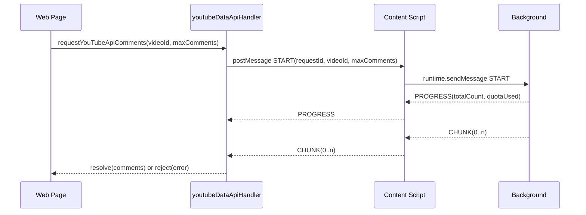

# YouTube Data API Messaging Architecture (Current)

This document describes the current messaging architecture for YouTube Data API v3 integration.

---

## Overview

YCS routes YouTube Data API requests through background service worker to keep API keys out of web page context.

Core reasons:

1. API key must stay in background storage.
2. Web page cannot directly use extension storage APIs.
3. Large comment sets require chunked transfer for message-size safety.

---

## Three-Layer Communication Model

```
YouTube.com Page (Web Resources)
|- appController.ts
|  |- invokes requestYouTubeApiComments(...) via handler
|
|- Handler: web-resources/handlers/youtubeDataApiHandler.ts
|  |- requestYouTubeApiComments()
|  |- window.postMessage() <-> Content Script
|
|- Content Script: content-scripts/cscripts.ts
|  |- relay window messages <-> chrome.runtime.sendMessage
|
`- Background: background.ts
   |- fetchAllCommentsBackground()
   |- API key in chrome.storage.local
   |- chunk/progress/error responses
```

---

## Sequence Diagram



---

## Message Types

### Requests (Web -> Background)

Comments (full load):
- `YCS_YT_API_COMMENTS_START`
- `YCS_YT_API_COMMENTS_ABORT`

Search (instant, one page):
- `YCS_YT_API_SEARCH_START`
- `YCS_YT_API_SEARCH_ABORT`

Replies (on-demand, all pages of one parent):
- `YCS_YT_API_REPLIES_START`
- `YCS_YT_API_REPLIES_ABORT`

### Responses (Background -> Web)

Comments (full load), primary active responses:
- `YCS_YT_API_COMMENTS_PROGRESS`
- `YCS_YT_API_COMMENTS_CHUNK`
- `YCS_YT_API_COMMENTS_ERROR`

Comments compatibility path retained in handler/content script:
- `YCS_YT_API_COMMENTS_COMPLETE` (legacy small-payload handling)

Search (instant):
- `YCS_YT_API_SEARCH_RESULT`
- `YCS_YT_API_SEARCH_ERROR`

Replies (on-demand):
- `YCS_YT_API_REPLIES_RESULT`
- `YCS_YT_API_REPLIES_ERROR`

---

## Payloads

### START

```typescript
{
  type: 'YCS_YT_API_COMMENTS_START',
  body: {
    videoId: string,
    requestId: string,
    maxComments?: number
  }
}
```

Example:

```json
{
  "type": "YCS_YT_API_COMMENTS_START",
  "body": {
    "videoId": "dQw4w9WgXcQ",
    "requestId": "d4821f60-6b1a-4d42-9a3f-2f2f9c4e9c3e",
    "maxComments": 5000
  }
}
```

### ABORT

```typescript
{
  type: 'YCS_YT_API_COMMENTS_ABORT',
  body: {
    requestId: string
  }
}
```

### PROGRESS

```typescript
{
  type: 'YCS_YT_API_COMMENTS_PROGRESS',
  body: {
    requestId: string,
    totalCount: number,
    quotaUsed: number
  }
}
```

### CHUNK

```typescript
{
  type: 'YCS_YT_API_COMMENTS_CHUNK',
  body: {
    requestId: string,
    comments: CommentItem[],
    chunkIndex: number,
    totalChunks: number,
    isLastChunk: boolean,
    quotaUsed?: number,
    incomplete?: boolean,
    replyFetchErrors?: number,
    error?: { type: string, message: string, code?: number },
    isError?: boolean
  }
}
```

Example (last chunk with metadata):

```json
{
  "type": "YCS_YT_API_COMMENTS_CHUNK",
  "body": {
    "requestId": "d4821f60-6b1a-4d42-9a3f-2f2f9c4e9c3e",
    "comments": [{ "_index": 19999 }, { "_index": 20000 }],
    "chunkIndex": 2,
    "totalChunks": 3,
    "isLastChunk": true,
    "quotaUsed": 37,
    "incomplete": false,
    "replyFetchErrors": 0
  }
}
```

### ERROR

```typescript
{
  type: 'YCS_YT_API_COMMENTS_ERROR',
  body: {
    requestId: string,
    error: {
      type: string,
      message: string,
      code?: number
    },
    partialComments?: CommentItem[]
  }
}
```

### SEARCH START

```typescript
{
  type: 'YCS_YT_API_SEARCH_START',
  body: {
    videoId: string,
    searchTerms: string,
    pageToken?: string,
    requestId: string
  }
}
```

Fetches one page of `commentThreads.list` with `searchTerms` (`part=snippet,replies`, `maxResults=100`, `textFormat=html`). Cost: ~1 quota unit per page.

**Auth:** background requires a non-empty `youtubeApiKey` only. `youtubeApiEnabled` does **not** apply to SEARCH — that flag gates full `YCS_YT_API_COMMENTS_START` load only. Instant search can run while full load still uses Innertube.

Example:

```json
{
  "type": "YCS_YT_API_SEARCH_START",
  "body": {
    "videoId": "dQw4w9WgXcQ",
    "searchTerms": "never gonna",
    "requestId": "a91c3e10-4f2b-4c11-9d0e-1b7f8c2a5e6d"
  }
}
```

### SEARCH ABORT

```typescript
{
  type: 'YCS_YT_API_SEARCH_ABORT',
  body: {
    requestId: string
  }
}
```

### SEARCH RESULT

```typescript
{
  type: 'YCS_YT_API_SEARCH_RESULT',
  body: {
    requestId: string,
    items: CommentItem[],
    nextPageToken?: string,
    totalResults?: number
  }
}
```

Single message, no chunking (one page is at most ~100 threads with replies, well below `CHUNK_SIZE`).

### SEARCH ERROR

```typescript
{
  type: 'YCS_YT_API_SEARCH_ERROR',
  body: {
    requestId: string,
    error: string,
    isQuotaExceeded?: boolean,
    aborted?: boolean
  }
}
```

### REPLIES START

```typescript
{
  type: 'YCS_YT_API_REPLIES_START',
  body: {
    videoId: string,
    parentId: string,
    requestId: string
  }
}
```

On-demand reply fetch: instant search results only carry the Data API's inline reply subset
(`part=snippet,replies`, <=5 per thread) while `renderer.replyCount` shows the true total.
Background loops `comments.list?parentId=` (`fetchCommentReplies`, `maxResults=100`,
`textFormat=html`) across **all** pages of the given parent and returns the raw `youtube#comment`
resources in one response — cost: ~1 quota unit per page of up to 100 replies. `videoId` is
accepted for parity with the other message families but not required by `comments.list` itself.

Transformation into `CommentItem` (`transformReplyToCommentItem`, `originComment` set) happens
**page-side**, not in background — the real parent `CommentItem` object only exists there.

**Auth:** background requires a non-empty `youtubeApiKey` only, same as SEARCH.

Example:

```json
{
  "type": "YCS_YT_API_REPLIES_START",
  "body": {
    "videoId": "dQw4w9WgXcQ",
    "parentId": "UgxABC123",
    "requestId": "b1c2d3e4-5f6a-4b7c-8d9e-0f1a2b3c4d5e"
  }
}
```

### REPLIES ABORT

```typescript
{
  type: 'YCS_YT_API_REPLIES_ABORT',
  body: {
    requestId: string
  }
}
```

### REPLIES RESULT

```typescript
{
  type: 'YCS_YT_API_REPLIES_RESULT',
  body: {
    requestId: string,
    items: YouTubeApiComment[],
    quotaUsed: number
  }
}
```

Single message, no chunking (a thread's total reply count is expected to stay well below
`CHUNK_SIZE`).

### REPLIES ERROR

```typescript
{
  type: 'YCS_YT_API_REPLIES_ERROR',
  body: {
    requestId: string,
    error: string,
    isQuotaExceeded?: boolean,
    aborted?: boolean
  }
}
```

---

## Chunking Strategy

Background uses:

- `CHUNK_SIZE = 20000` in `background.ts`
- `sendCommentsInChunks(...)` for completion and fetch-time error delivery
- Preflight validation errors (e.g., missing/disabled API key) use direct `YCS_YT_API_COMMENTS_ERROR`

Handler (`youtubeDataApiHandler.ts`) reassembles chunks by `chunkIndex` and resolves/rejects when `isLastChunk` is received.

Instant search (`YCS_YT_API_SEARCH_*`) does not use chunking. Each `SEARCH_START` resolves with one `SEARCH_RESULT` or `SEARCH_ERROR`.

On-demand replies (`YCS_YT_API_REPLIES_*`) does not use chunking either. Unlike SEARCH, background
loops internally across all pages of the parent before responding — the page side gets a single
`REPLIES_RESULT` (or `REPLIES_ERROR`) per `REPLIES_START`, not one message per page.

---

## Request Safety

Handler-level safety in `requestYouTubeApiComments(...)`:

- global request timeout: 5 minutes
- abort wait timeout: 3 seconds after ABORT request
- per-request filtering by `requestId`

Background-level safety:

- active request tracking via `activeYouTubeApiRequests: Map<requestId, { controller, tabId }>`
- tab close cleanup aborts in-flight requests

---

## Security Model

- API key stored only in background (`chrome.storage.local`).
- Content script strips `youtubeApiKey` before sending options to web page.
- Web page receives only `hasYoutubeApiKey` flag and uses messaging APIs.
- Instant search preserves the same boundary: the API key is read from `chrome.storage.local` in background only; the page side never receives the key and only sees the derived `hasYoutubeApiKey` boolean.
- Instant SEARCH preflight requires a non-empty API key only. Full COMMENTS load still requires key + `youtubeApiEnabled`.
- On-demand REPLIES preflight requires a non-empty API key only, same as SEARCH — `youtubeApiEnabled` does not gate it either.

---

## Error Model

Mapped response types include:

- `quotaExceeded`
- `invalidApiKey`
- `unsupported`
- `apiError`
- `aborted`
- `unknown`

Partial comments are preserved when available and returned in chunk/error responses.

---

## Related Files

- `app/src/source/web-resources/handlers/youtubeDataApiHandler.ts` (includes `requestYouTubeApiCommentSearch`, `requestYouTubeApiCommentReplies`)
- `app/src/source/background.ts`
- `app/src/source/content-scripts/cscripts.ts`
- `app/src/source/web-resources/appController.ts`
- `app/src/source/web-resources/search/instantCommentsSearch.ts`
- `app/src/source/web-resources/search/instantReplyFetch.ts` (on-demand reply fetch + merge, Task 18)
- `app/src/source/web-resources/ui/commentInteractions.ts` (`handleOpenReply` instant-mode DI hook)
- `app/src/source/utils/youtubeDataApi/client.ts`
- `app/src/source/utils/youtubeDataApi/search.ts`
- `app/src/source/utils/youtubeDataApi/transform.ts`
